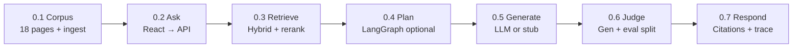

# PoE Wiki Agent


Path of Exile **1** wiki-grounded Q&A for portfolio and learning. Ask mechanics questions; get answers with citations from [poewiki.net](https://www.poewiki.net/wiki/Path_of_Exile_Wiki).


**Browser docs** (with API running): [Architecture](http://127.0.0.1:8000/docs/architecture.html) · [Changelog](http://127.0.0.1:8000/docs/changelog.html)


## Quick start


```powershell

cd Project

python -m venv .venv

.venv\Scripts\activate

pip install -e ".[dev,speech]"


copy .env.example .env

```


**Preferred — one click:** double-click `start.bat` (or run `.\start.ps1`). Builds the React UI if needed, then starts the API.


- App: http://127.0.0.1:8000/

- API: http://127.0.0.1:8000

- Docs: http://127.0.0.1:8000/docs/


**UI development (hot reload):**


```powershell

# Terminal 1

uvicorn poe_agent.harness.api.app:app --reload --host 127.0.0.1 --port 8000


# Terminal 2

cd web

npm install

npm run dev

```


Vite runs on http://localhost:5173 and proxies API routes to port 8000.


## Index wiki content (once)


```powershell

poe-ingest

```


Fetches **18 curated** PoE 1 pages → `data/chunks/` + `data/chroma/`. Restart API if it was running during ingest.


## Answer mode


Use the **sidebar** to switch **stub**, **ollama**, **claude**, or **gpt4**. Claude/GPT-4 need API keys in `.env`. Each answer shows quality scores and an expandable LLM trace.


## Regenerate docs


After editing `docs/ARCHITECTURE.md` or `docs/CHANGELOG.md`:


```powershell

python scripts/sync_docs.py

```


---


# PoE Wiki Agent — Architecture

Path of Exile **1** wiki-grounded Q&A. Single source of truth: edit this file, then run `python scripts/sync_docs.py` for `README.md` and browser HTML.

## What kind of system is this?

| Label | Applies? | Meaning here |
|-------|----------|----------------|
| **RAG** (Retrieval-Augmented Generation) | Yes | Each answer starts by **retrieving wiki excerpts** (local index and/or live poewiki fetch), then the LLM (or stub) writes using only those excerpts. |
| **Agentic AI** | Sometimes | With a non-stub LLM and retrieval available, **LangGraph** may run **multiple retrieval steps** before answering (e.g. compare ignite vs poison). |
| **Full wiki search** | No | We do **not** query all ~16,000 poewiki articles. Local mode uses a **curated allowlist** of 18 PoE 1 mechanic pages. |
| **Live wiki per question** | Configurable | Default **`RETRIEVAL_MODE=live`**: MediaWiki search + fetch at Ask time (cached under `data/live_cache/`). Use **`local`** for offline index only, or **`hybrid`** to supplement weak local hits. |

**Important:** All LLM modes only see **top-k retrieved chunks** (about 5 after reranking), not the whole curated corpus.

---

## Pipeline overview

End-to-end flow (left to right). **Interactive version** (hover each step for detail; faded options are paths we did not choose) is rendered on the [browser architecture page](http://127.0.0.1:8000/docs/architecture.html#pipeline-interactive).




---

## Provider modes

| Mode | Generation | API key | Set via |
|------|------------|---------|---------|
| **stub** | Wiki excerpt only | None | UI or `.env` |
| **ollama** | Local `llama3.2` | None (local) | UI or `.env` |
| **claude** | Anthropic API | `ANTHROPIC_API_KEY` | UI or `.env` |
| **gpt4** | OpenAI API | `OPENAI_API_KEY` | UI or `.env` |
| **bedrock** | AWS Bedrock | AWS credentials | `.env` only |

Claude Pro and ChatGPT Plus are **not** the same as API billing. Embeddings stay **local sentence-transformers** except in bedrock mode.

### Retrieval modes

| `RETRIEVAL_MODE` | Behavior |
|------------------|----------|
| **live** (default) | Search poewiki.net → fetch top pages → chunk in memory → cross-encoder rerank. No Chroma required for Ask. |
| **local** | Hybrid dense + BM25 on the ingested index only (`poe-ingest`). |
| **hybrid** | Local retrieve first; if no chunks or weak top scores, supplement with live fetch. |

Supporting env vars: `LIVE_WIKI_MAX_PAGES`, `LIVE_WIKI_SEARCH_LIMIT`, `LIVE_WIKI_MAX_SEARCH_QUERIES`, `LIVE_WIKI_TITLE_PROBE`, `LIVE_WIKI_TITLE_OVERLAP_FILTER`, `LIVE_WIKI_CACHE_TTL_HOURS`. Each `wiki_search` call fuses the **verbatim user question**, the subtask query (LangGraph), keyword variants, and optional **direct title fetch** before one rerank against the user question. Live mode adds typical **+2–8s** retrieval latency per question (more with multiple LangGraph subtasks).

**Optional refinement (Phase 2):** `RETRIEVAL_REFINE_ENABLED=true` runs a heuristic gate after retrieval; on weak results, a short LLM generates 1–2 new search strings and fetches once more (`RETRIEVAL_MAX_REFINE_ROUNDS=1`).

---

<details class="arch-collapse">
<summary>Quality metrics reference</summary>

Evaluation is split into **retrieval** (did we fetch the right wiki pages?) and **generation** (is the answer good given what we fetched?). Scores are **display-only** — they do not change the answer or trigger retries.

### Retrieval metrics (after every Ask)

Two **LLM-as-judge** scores (0–100% in the UI; judge returns 1–5, normalized to 0–1):

| Metric | How computed | What it tells you |
|--------|----------------|-------------------|
| **Context precision** | Judge rates retrieved chunk excerpts vs your question | How much of what we retrieved is actually relevant? |
| **Context recall** | Judge rates whether retrieval captured enough to answer | Did we pull in the key facts needed? |

These are **approximations** inspired by RAGAS context precision/recall — not exact chunk-level math.

**Evaluate / gold set:** `POST /evaluate` with `expected_pages` still computes exact **retrieval precision** and **retrieval recall** on page-title overlap for regression tests.

### Generation metrics (inline after every Ask)

Three separate **LLM-as-judge** calls (1–5, higher is better), run after the answer is written:

| Metric | How computed | What it tells you |
|--------|----------------|-------------------|
| **Faithfulness** | Judge compares answer to retrieved chunk text | Are claims grounded in the wiki excerpts? (Also the main proxy for hallucination risk.) |
| **Relevance** | Judge compares answer to your question | Does the answer address what you asked? |
| **Prompt adherence** | Judge checks PoE 1 + excerpts-only rules | Did the model follow system constraints? |

**Timing** (`perf_counter` per phase) is observability in the trace, not a quality grade.

### Judge models

| Setting | Meaning |
|---------|---------|
| `JUDGE_PROVIDER` | Which backend runs judges: **ollama** (default in `.env`), **claude**, **gpt4**, or **bedrock**. Selecting Claude or GPT-4 in the UI **auto-matches** judges to the same provider for that session |
| `INLINE_EVAL=false` | Skip all inline judges on `/query` (retrieval + generation) |

Inline Ask runs **five** judge calls when enabled: context precision, context recall, faithfulness, relevance, prompt adherence.

**Harness** = your code under `src/poe_agent/harness/` (FastAPI, React UI, config, logging) — not a third-party product.

</details>

<details class="arch-collapse">
<summary>Scaling to the full wiki</summary>

Today the corpus is **18 curated pages** in `knowledge/seed_pages.yaml`, not all of poewiki (~16k articles).

### Phase 1 — Today

- Edit `seed_pages.yaml` → run `poe-ingest` → restart the API if it was running during ingest.

### Phase 2 — Medium corpus

- Category crawl via MediaWiki API, or link crawl outward from seed pages (rate-limited).

### Phase 3 — Large corpus

- Full wiki dump or `allpages` pagination; incremental updates; larger Chroma index and disk use.

### Phase 4 — Quality at scale

- Section-aware chunking; “I don’t know” when retrieval is weak; PoE1 filters on live search hits (v2).

Check the [poewiki license](https://www.poewiki.net/wiki/Path_of_Exile_Wiki:Copyrights) before public deployment.

</details>

---

## Further reading

- [LangGraph](https://langchain-ai.github.io/langgraph/)
- [Path of Exile Wiki](https://www.poewiki.net/wiki/Path_of_Exile_Wiki)
- [AWS Bedrock](https://docs.aws.amazon.com/bedrock/) (optional)
