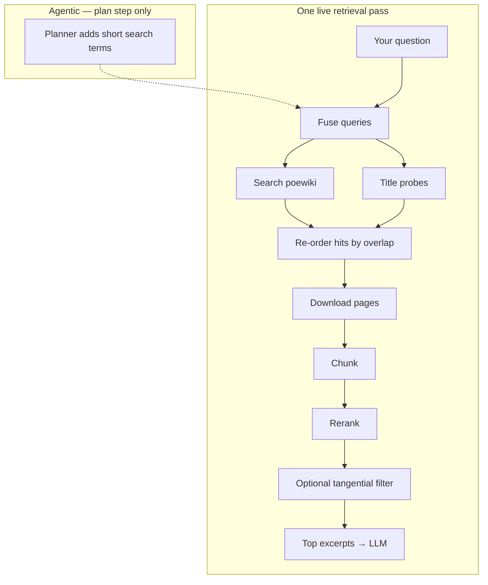

# Siosa's Library

**Path of Exile 1** wiki Q&A — live [poewiki.net](https://www.poewiki.net) retrieval, cited answers, optional LangGraph planning.

**Demo** [poesiosa.net](https://www.poesiosa.net/) · **Docs** [Architecture](docs/architecture.html) · [Changelog](docs/changelog.html) · [Deploy](DEPLOY.md)  
*(local: http://127.0.0.1:8000/docs/architecture.html with API running)*

## How it works



**Interactive pipeline** (hover steps, alternatives): open [Architecture](docs/architecture.html#pipeline-overview). Algorithm detail, providers, judges, and deploy notes live there—not duplicated here.

## Quick start

```powershell
cd Project
python -m venv .venv
.venv\Scripts\activate
pip install -e ".[dev,speech]"
copy .env.example .env
```

**One click:** `start.bat` or `.\start.ps1` → http://127.0.0.1:8000/

| | |
|--|--|
| **Provider** | `stub` / `claude` / `gpt4` in UI (keys in `.env`) |
| **Score** | On-demand judges after Ask (`INLINE_EVAL=false` default) |
| **Offline index** | `poe-ingest` once → `RETRIEVAL_MODE=local` (18 curated pages) |

**UI dev:** API on `:8000`, `cd web && npm run dev` on `:5173` (proxied).

## Regenerate docs

```powershell
python scripts/sync_docs.py
```

Edits go in `docs/ARCHITECTURE.md` and `docs/CHANGELOG.md`; `README.md` is generated from this header only.

## License

Source code: [MIT](LICENSE). Game artwork in `web/public/art assets/` is **not** MIT-licensed — see [NOTICE](NOTICE). Not affiliated with Grinding Gear Games.
