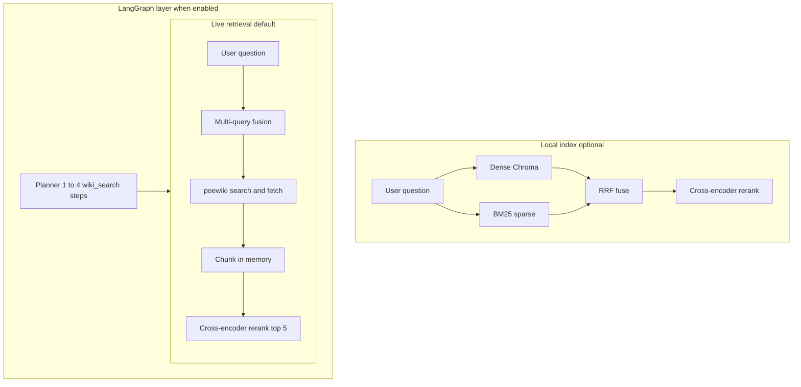
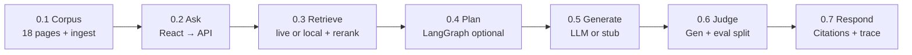

# PoE Wiki Agent


Path of Exile **1** wiki-grounded Q&A for portfolio and learning. Ask mechanics questions; get answers with citations from [poewiki.net](https://www.poewiki.net/wiki/Path_of_Exile_Wiki).


**Browser docs** (with API running): [Architecture](http://127.0.0.1:8000/docs/architecture.html) · [Changelog](http://127.0.0.1:8000/docs/changelog.html)


## Quick start


```powershell

cd Project

python -m venv .venv

.venv\Scripts\activate

pip install -e ".[dev,speech]"


copy .env.example .env

```


**Preferred — one click:** double-click `start.bat` (or run `.\start.ps1`). Builds the React UI if needed, then starts the API.


- App: http://127.0.0.1:8000/

- API: http://127.0.0.1:8000

- Docs: http://127.0.0.1:8000/docs/


**UI development (hot reload):**


```powershell

# Terminal 1

uvicorn poe_agent.harness.api.app:app --reload --host 127.0.0.1 --port 8000


# Terminal 2

cd web

npm install

npm run dev

```


Vite runs on http://localhost:5173 and proxies API routes to port 8000.


## Index wiki content (once)


```powershell

poe-ingest

```


Fetches **18 curated** PoE 1 pages → `data/chunks/` + `data/chroma/`. Restart API if it was running during ingest.


## Answer mode


Use the **sidebar** to switch **stub**, **claude**, or **gpt4**. Claude/GPT-4 need API keys in `.env`. Each answer shows quality scores and an expandable LLM trace.


## Regenerate docs


After editing `docs/ARCHITECTURE.md` or `docs/CHANGELOG.md`:


```powershell

python scripts/sync_docs.py

```


---


# PoE Wiki Agent — Architecture

Path of Exile **1** wiki-grounded Q&A. Single source of truth: edit this file, then run `python scripts/sync_docs.py` for `README.md` and browser HTML.

## What kind of system is this?

| Label | Applies? | Meaning here |
|-------|----------|----------------|
| **RAG** (Retrieval-Augmented Generation) | Yes | Each answer starts by **retrieving wiki excerpts** (local index and/or live poewiki fetch), then the LLM (or stub) writes using only those excerpts. |
| **Agentic AI** | Sometimes | With a non-stub LLM and retrieval available, **LangGraph** may run **multiple retrieval steps** before answering (e.g. separate wiki lookups for ignite vs poison). |
| **Full wiki search** | No | We do **not** query all ~16,000 poewiki articles. Local mode uses a **curated allowlist** of 18 PoE 1 mechanic pages. |
| **Live wiki per question** | Configurable | Default **`RETRIEVAL_MODE=live`**: MediaWiki search + fetch at Ask time (cached under `data/live_cache/`). Use **`local`** for offline index only, or **`hybrid`** to supplement weak local hits. |

**Important:** All LLM modes only see **top-k retrieved chunks** (about 5 after reranking), not the whole curated corpus.

---

## How to explain this system

Use this as a booth or resume pitch:

This is a **wiki-grounded RAG system** for **Path of Exile 1**: you ask a mechanics question, the app **searches poewiki.net** (by default at Ask time), keeps the best passages after **reranking**, and an **LLM** (Claude or GPT-4, switchable in the UI) writes a short answer with **citations** to the wiki pages it used. For harder questions, **LangGraph** can run a **planner** that issues **one or more wiki lookups** before synthesis—not a search of the entire wiki, but targeted fetches. A **public demo** runs at [poesiosa.net](https://www.poesiosa.net/). Operators: see [DEPLOY.md](../DEPLOY.md).

There is **no** per-user control over answer style (fixed system prompt). There is **no** large formal user study—quality is checked with a **small labeled gold set**, optional **LLM judges**, and **trace-based** debugging.

---

## Retrieval: live vs local hybrid

The word **hybrid** means different things in different layers. Do not conflate them.

| Term | Meaning here |
|------|----------------|
| **Hybrid retrieval (local)** | On the **ingested index only**: dense vectors in **ChromaDB** + **BM25** keyword search, merged with **Reciprocal Rank Fusion (RRF)**, then **cross-encoder rerank**. Used when `RETRIEVAL_MODE=local` or as the first leg of `hybrid`. |
| **Live retrieval (default)** | **Multiple MediaWiki search strings** per retrieval pass (**multi-query fusion**), union of hits, fetch up to **`LIVE_WIKI_MAX_PAGES`** full pages, chunk in memory, **cross-encoder rerank** vs the user question. Does **not** use BM25 on the whole wiki. |
| **Multi-query fusion** | Runs on **every** live `wiki_search` call—whether the overall pipeline is linear or LangGraph. Fuses verbatim question, keyword variants, subtask query, and optional **title probes**. |
| **LangGraph multi-search** | **Separate** `wiki_search` passes when the planner emits multiple retrieve subtasks (up to **`PLANNER_MAX_RETRIEVE_SUBTASKS`**). Compare-style questions are a common case, not the only case. |



### Data, chunks, and online vs offline

| | **Offline / local index** | **Online / live (default)** |
|--|---------------------------|-----------------------------|
| **Corpus** | 18 pages in [`seed_pages.yaml`](../src/poe_agent/knowledge/seed_pages.yaml) | Whatever poewiki search returns per question |
| **Build** | `poe-ingest` → `data/chunks/chunks.jsonl` + Chroma under `data/chroma/` | Fetch at Ask time; disk cache `data/live_cache/` (TTL via `LIVE_WIKI_CACHE_TTL_HOURS`) |
| **`chroma_ready` on `/health`** | `true` after ingest | Often **`false` on production**—expected when live-only deploy never runs ingest; **not** a sign the app is broken |

**Default sizing (tunable in [`.env.example`](../.env.example)):**

| Knob | Typical default | Role |
|------|-----------------|------|
| `LIVE_WIKI_MAX_PAGES` | 5 | Max full wiki pages fetched per fusion pass |
| `RERANK_TOP_N` | 5 | Chunks passed to the generator after rerank |
| Chunk ingest | ~1800 chars, 200 overlap | Fixed-size chunking in [`ingest.py`](../src/poe_agent/retriever/ingest.py) |
| `LIVE_WIKI_MAX_SEARCH_QUERIES` | 4 | Cap on fused search strings per live pass |

---

## Agent routing: linear vs LangGraph

| Pipeline trace | When it runs |
|----------------|--------------|
| **`langgraph`** | Retrieval available and provider is not **`stub`** or **`linear`**—typical for **Claude / GPT-4** in the UI |
| **`linear_rag`** | Provider **`stub`** or **`linear`**, or LangGraph not used |

The planner (LLM JSON, with heuristic fallback) may emit **one** retrieve subtask or **several** short wiki queries before synthesis. Each subtask calls `wiki_search`, which still runs **multi-query fusion** inside the pass.

**Optional refinement:** `RETRIEVAL_REFINE_ENABLED=true` adds a gated second fetch round (LangGraph and linear).

Implementation: [`query_service.py`](../src/poe_agent/harness/api/query_service.py), [`graph.py`](../src/poe_agent/orchestrator/graph.py).

---

## Pipeline overview

End-to-end flow (left to right). **Interactive version** (hover each step for detail; faded options are paths we did not choose) is rendered on the [browser architecture page](http://127.0.0.1:8000/docs/architecture.html#pipeline-interactive).




---

## Provider modes

| Mode | Generation | API key | Set via |
|------|------------|---------|---------|
| **stub** | Wiki excerpt only | None | UI or `.env` |
| **claude** | Anthropic API | `ANTHROPIC_API_KEY` | UI or `.env` |
| **gpt4** | OpenAI API | `OPENAI_API_KEY` | UI or `.env` |
| **bedrock** | AWS Bedrock | AWS credentials | `.env` only |

Claude Pro and ChatGPT Plus are **not** the same as API billing. Embeddings stay **local sentence-transformers** except in bedrock mode.

### Retrieval modes

| `RETRIEVAL_MODE` | Behavior |
|------------------|----------|
| **live** (default) | Search poewiki.net → fetch top pages → chunk in memory → cross-encoder rerank. No Chroma required for Ask. |
| **local** | Hybrid dense + BM25 on the ingested index only (`poe-ingest`). |
| **hybrid** | Local retrieve first; if no chunks or weak top scores, supplement with live fetch. |

Supporting env vars: `LIVE_WIKI_MAX_PAGES`, `LIVE_WIKI_SEARCH_LIMIT`, `LIVE_WIKI_MAX_SEARCH_QUERIES`, `LIVE_WIKI_TITLE_PROBE`, `LIVE_WIKI_TITLE_OVERLAP_FILTER`, `LIVE_WIKI_CACHE_TTL_HOURS`. Each `wiki_search` call fuses the **verbatim user question**, the subtask query (LangGraph), keyword variants, and optional **direct title fetch** before one rerank against the user question. Live mode adds typical **+2–8s** retrieval latency per question (more with multiple LangGraph subtasks).

**Optional refinement (Phase 2):** `RETRIEVAL_REFINE_ENABLED=true` runs a heuristic gate after retrieval; on weak results, a short LLM generates 1–2 new search strings and fetches once more (`RETRIEVAL_MAX_REFINE_ROUNDS=1`).

### Local vs production

| | **Local dev** | **Production** ([poesiosa.net](https://www.poesiosa.net/)) |
|--|---------------|--------------------------------------------------------------|
| Config | [`.env`](.env.example) | Railway **Variables** ([`railway.variables.example`](../railway.variables.example)) |
| Inline judges | `INLINE_EVAL=false` (default); **Score response** button runs five judges on demand | `INLINE_EVAL=false` — no judge LLM calls |
| UI | Full: trace, timing, on-demand scores (`dev_ui_enabled`) | Booth: Answer + Sources only |
| Cloud LLMs | `ANTHROPIC_API_KEY`, `OPENAI_API_KEY` in `.env` | Same keys in Railway Variables |

Production uses the same codebase; env vars control booth vs dev behavior. Push to `main` redeploys on Railway.

---

## Evaluation, gold set, and limits

| What | Detail |
|------|--------|
| **Gold set** | **10** hand-labeled rows in [`gold.jsonl`](../src/poe_agent/knowledge/eval/gold.jsonl): `expected_pages` for exact **retrieval precision/recall**; optional `gold_answer` for token-overlap **extraction** on `POST /evaluate` |
| **Inline judges** | Custom **LLM-as-judge** prompts (RAGAS-inspired names). **Five** calls via `POST /score` or when `INLINE_EVAL=true`. All judges share the same **1200-char/chunk** excerpts as the answer LLM (`format_evidence_context`). |
| **Production** | `INLINE_EVAL=false`, `dev_ui_enabled=false` — no judges, booth UI only |
| **User feedback** | **Provider** choice only (stub / Claude / GPT-4)—no UI for answer length, tone, or thumbs up/down |
| **Studies / MLOps** | No large user study; no MLflow, W&B, or vLLM in this project. Improvement loop: **traces**, spot checks, and small gold regression |

A **`verbosity`** judge exists in code but is **not** run on inline `/query`.

---

<details class="arch-collapse">
<summary>Quality metrics reference</summary>

Evaluation is split into **retrieval** (did we fetch the right wiki pages?) and **generation** (is the answer good given what we fetched?). Scores are **display-only** — they do not change the answer. Local dev: click **Score response** after Ask (sends retrieved chunk text from the trace to `POST /score`). Set `INLINE_EVAL=true` to judge every Ask automatically.

### Retrieval metrics (on Score response or inline eval)

Two **LLM-as-judge** scores (0–100% in the UI; judge returns 1–5, normalized to 0–1):

| Metric | How computed | What it tells you |
|--------|----------------|-------------------|
| **Context precision** | Judge rates retrieved chunk excerpts vs your question | How much of what we retrieved is actually relevant? |
| **Context recall** | Judge rates whether retrieval captured enough to answer | Did we pull in the key facts needed? |

These are **approximations** inspired by RAGAS context precision/recall — not exact chunk-level math.

**Evaluate / gold set:** `POST /evaluate` with `expected_pages` computes exact **retrieval precision** and **retrieval recall** on page-title overlap. Batch over `gold.jsonl` via evaluator service helpers.

### Generation metrics (on Score response or inline eval)

Three separate **LLM-as-judge** calls (1–5, higher is better), run after the answer is written:

| Metric | How computed | What it tells you |
|--------|----------------|-------------------|
| **Faithfulness** | Judge compares answer to the same wiki excerpts as the generator | Are claims grounded in the excerpts? |
| **Relevance** | Judge compares answer to your question | Does the answer address what you asked? |
| **Prompt adherence** | Judge checks rules **and** wiki excerpts | Did the answer follow excerpts-only constraints given what was retrieved? |

**Timing** (`plan`, `retrieval`, `generation`, `evaluation` ms in trace) is observability only — LangGraph uses `perf_counter` per node with no extra LLM cost.

### Judge models

| Setting | Meaning |
|---------|---------|
| `JUDGE_PROVIDER` | Which backend runs judges: **claude** (default in `.env`), **gpt4**, or **bedrock**. Selecting Claude or GPT-4 in the UI **auto-matches** judges to the same provider for that session |
| `INLINE_EVAL=false` | Default: no judges on `/query`; use **Score response** or `POST /score` |
| `dev_ui_enabled` | `false` on `DEPLOYMENT_PROFILE=production`; else trace, timing, score button |

Five judge calls when scoring: context precision, context recall, faithfulness, relevance, prompt adherence.

**Harness** = your code under `src/poe_agent/harness/` (FastAPI, React UI, config, logging) — not a third-party product.

</details>

---

## Deployment and cost snapshot

| Piece | What it is here |
|-------|-----------------|
| **Docker** | Multi-stage image: build React UI, install Python package, pre-download rerank model; one container serves API + static UI |
| **Railway** | Platform-as-a-service: connects to GitHub, builds the Dockerfile on push to `main`, runs the container with env vars for API keys |
| **GitHub Actions** | CI: lint (`ruff`), tests (`pytest`), verify Docker build |

**Rough cost** (see [DEPLOY.md § Billing](../DEPLOY.md#billing-rough)): Railway Hobby ~**$5/mo** plus RAM/CPU while running (~**$12–25** for a busy week at 4 GB); **Anthropic/OpenAI** billed per Ask separately.

**Latency:** Slowness on live deploy is mainly **poewiki fetch + rerank** (+ **five judge LLM calls** when `INLINE_EVAL=true` locally). Production skips judges. The demo path does **not** require AWS Bedrock or vLLM—cloud **Claude/GPT-4 APIs** plus local cross-encoder rerank are sufficient.

---

<details class="arch-collapse">
<summary>Explicit non-goals (this repo)</summary>

- **vLLM** — not used; generation via OpenAI/Anthropic APIs or stub
- **MLflow / Weights & Biases** — not used; eval via gold set, `/evaluate`, and inline judges
- **RAGAS library** — metrics are custom LLM judges with similar names
- **Full poewiki index** — 18-page allowlist + live search, not ~16k articles ingested
- **Formal large-scale user study** — portfolio demo + small labeled set only
- **Per-user answer-style preferences** — fixed system prompt

</details>

<details class="arch-collapse">
<summary>Scaling to the full wiki</summary>

Today the corpus is **18 curated pages** in `knowledge/seed_pages.yaml`, not all of poewiki (~16k articles).

### Phase 1 — Today

- Edit `seed_pages.yaml` → run `poe-ingest` → restart the API if it was running during ingest.

### Phase 2 — Medium corpus

- Category crawl via MediaWiki API, or link crawl outward from seed pages (rate-limited).

### Phase 3 — Large corpus

- Full wiki dump or `allpages` pagination; incremental updates; larger Chroma index and disk use.

### Phase 4 — Quality at scale

- Section-aware chunking; “I don’t know” when retrieval is weak; PoE1 filters on live search hits (v2).

Check the [poewiki license](https://www.poewiki.net/wiki/Path_of_Exile_Wiki:Copyrights) before public deployment.

</details>

---

## Further reading

- [LangGraph](https://langchain-ai.github.io/langgraph/)
- [Path of Exile Wiki](https://www.poewiki.net/wiki/Path_of_Exile_Wiki)
- [DEPLOY.md](../DEPLOY.md) — Railway, Docker, billing, booth variables
- [AWS Bedrock](https://docs.aws.amazon.com/bedrock/) (optional)
