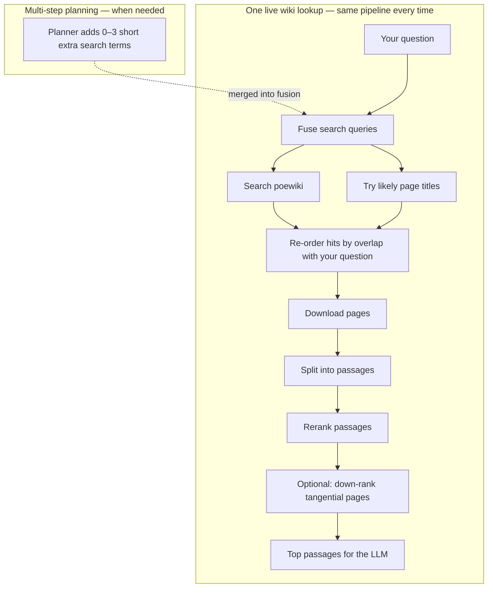

# Siosa's Library — Architecture

*Figure: Each Ask is one request (no chat memory). The harness picks Claude or GPT-4; the planner may add short search terms that merge into one fused wiki lookup; generation uses the top passages; scoring is optional and does not loop back into retrieval or the answer.*

**Siosa's Library** answers Path of Exile 1 mechanics questions using the live [poewiki.net](https://www.poewiki.net) wiki. You type a question; the app finds relevant wiki pages, picks the best passages, and writes a short answer with links to the sources. Try it at [poesiosa.net](https://www.poesiosa.net/). For harder questions, a planner can add short search terms before that single lookup.

The LLM only sees **top reranked passages** (typically five), not whole articles. Answer style is fixed; there is no per-user tone control.

---

## Live retrieval

Each Ask searches poewiki, fetches full pages, splits them into passages in memory, and reranks to find the best matches for your question.

*Figure: **Multi-step planning** adds extra lookup strings for comparison-style questions. **One lookup** = everything in the lower box runs once per answer step—search, fetch, chunk, rerank—even when several search angles were planned.*

**Planning.** A planner may emit several retrieve intents (short search terms). The executor merges them into **one** fused wiki lookup; those terms are not revised from what was retrieved. When enabled, an optional refinement step may trigger **one** extra lookup if the first results look weak.

The project also supports a small offline index for development; the public demo uses live wiki search only.

---

## Pipeline overview

<!-- INTERACTIVE_PIPELINE -->

## Provider modes

| Mode | What you get | API key |
|------|--------------|---------|
| **claude** | Anthropic Claude answer | Anthropic |
| **gpt4** | OpenAI GPT-4 answer | OpenAI |

Claude Pro / ChatGPT Plus subscriptions are **not** API access. Voice input uses cloud transcription when enabled. Missing API keys return a clear error (there is no stub answer mode).

---

## Rate limits

The app is in active development. Optional daily caps protect API cost if the public demo is used by others.

- **Unit today:** one **Ask** (`POST /query`). Score and page views are not counted yet; the same module can later count LLM or tool calls.
- **Cap:** `RATE_LIMIT_ASKS_PER_DAY` (default **20**) per client IP per **UTC** calendar day.
- Over quota returns HTTP **429** until the next UTC midnight.

### Operator analytics

When `OPERATOR_ANALYTICS_ENABLED=true`, the server logs coarse events to `data/operator_analytics.sqlite`:

- **visit** — at most one per hashed IP per UTC day when someone opens the app (`GET /`)
- **ask** — every `POST /query`

Each row stores UTC time, action, **hashed** IP, and country code if a proxy header provides one (e.g. Cloudflare). Raw IPs are not stored in this table.

Private HTML dashboard (requires `OPERATOR_DASHBOARD_KEY`): `/operator/analytics?key=...` — summary of unique visitors, visits, and Asks. Local and production each have their **own** database; open the matching host. On Railway, mount a **volume** at `/app/data` so data survives redeploys.

Rate limiting may still use IP in its own SQLite file when enabled.

### Session memory

When `SESSION_MEMORY_ENABLED=true` (default), each Ask may include conversation context from the same browser session (`session_id` UUID). The UI keeps the id in local storage, shows the thread, and offers **New conversation**. Click a prior turn to expand sources, timing, Score, and traces.

The server stores **all** turns in `data/session_memory.sqlite`. For the model prompt it keeps the last `SESSION_MEMORY_RECENT_TURNS` (default 8) verbatim and, when enabled, a rolling **summary** of older turns (`SESSION_MEMORY_SUMMARY_ENABLED`). Prior topics are also fed into wiki search planning so follow-ups like “does that apply?” still retrieve the right pages.

---

## Quality metrics

Scores are **for demonstration**—they run **after** Ask (click **Score response**) and do **not** re-run retrieval or change the answer.

**Retrieval (2 metrics, 0–100% in UI)**

- **Context precision** — How much of the retrieved wiki text actually matters for your question.
- **Context recall** — Whether retrieval pulled in enough facts to answer well.

**Generation (3 metrics, 1–5, higher is better)**

- **Faithfulness** — Whether claims in the answer are supported by the retrieved excerpts.
- **Relevance** — Whether the answer addresses what you asked.
- **Prompt adherence** — Whether the answer follows PoE 1 focus and excerpts-only rules given what was retrieved.

---

## Further reading

- [Path of Exile Wiki](https://www.poewiki.net/wiki/Path_of_Exile_Wiki)
