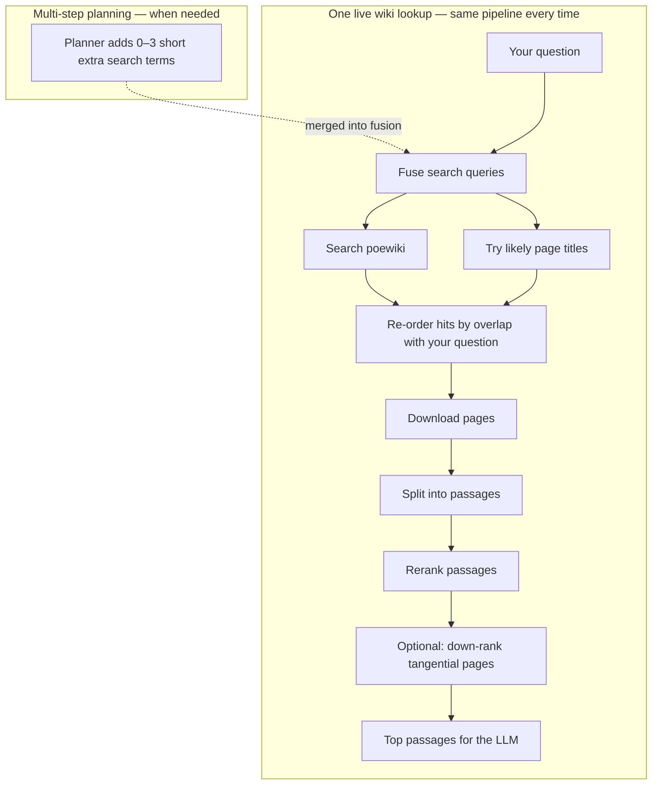

# Siosa's Library — Architecture

**Siosa's Library** answers Path of Exile 1 mechanics questions using the live [poewiki.net](https://www.poewiki.net) wiki. You type a question; the app finds relevant wiki pages, picks the best passages, and writes a short answer with links to the sources. Try it at [poesiosa.net](https://www.poesiosa.net/). For harder questions, the system can plan several search angles before answering—it does not search all ~16,000 wiki articles, only what is relevant to your question.

The LLM only sees **top reranked passages** (typically five), not whole articles. Answer style is fixed; there is no per-user tone control.

---

## Live retrieval

Each Ask searches poewiki, fetches full pages, splits them into passages in memory, and reranks to find the best matches for your question.

*Figure: **Multi-step planning** adds extra lookup strings for comparison-style questions. **One lookup** = everything in the lower box runs once per answer step—search, fetch, chunk, rerank—even when several search angles were planned.*

**Planning vs single pass.** With Claude or GPT-4, a planner may emit several retrieve intents, but the executor merges them into **one** fused wiki lookup per step. The simple **stub** mode skips planning and runs a single lookup from your question. When enabled, an optional refinement step may trigger **one** extra lookup if the first results look weak.

The project also supports a small offline index for development; the public demo uses live wiki search only.

---

## Pipeline overview

<!-- INTERACTIVE_PIPELINE -->

## Provider modes

| Mode | What you get | API key |
|------|--------------|---------|
| **stub** | Wiki excerpt only, no LLM | None |
| **claude** | Anthropic Claude answer | Anthropic |
| **gpt4** | OpenAI GPT-4 answer | OpenAI |

Claude Pro / ChatGPT Plus subscriptions are **not** API access. Voice input uses cloud transcription when enabled.

---

## Quality metrics

Scores are **for demonstration**—they do **not** change retrieval or the answer. After Ask, click **Score response** to run quality checks.

**Retrieval (2 metrics, 0–100% in UI)**

- **Context precision** — How much of the retrieved wiki text actually matters for your question.
- **Context recall** — Whether retrieval pulled in enough facts to answer well.

**Generation (3 metrics, 1–5, higher is better)**

- **Faithfulness** — Whether claims in the answer are supported by the retrieved excerpts.
- **Relevance** — Whether the answer addresses what you asked.
- **Prompt adherence** — Whether the answer follows PoE 1 focus and excerpts-only rules given what was retrieved.

---

## Further reading

- [Path of Exile Wiki](https://www.poewiki.net/wiki/Path_of_Exile_Wiki)
