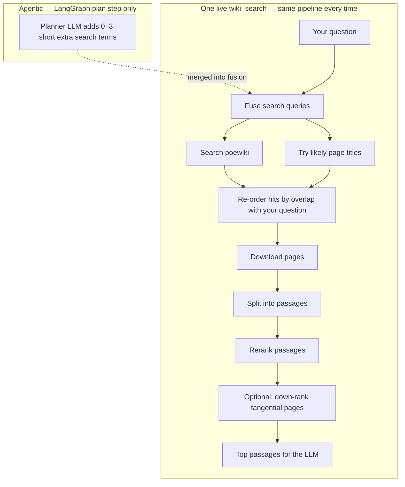

# Developer architecture

Technical reference for contributors and operators. The visitor-facing summary lives in [`docs/ARCHITECTURE.md`](docs/ARCHITECTURE.md) (synced to [architecture.html](docs/architecture.html)).

## What this system is

**Siosa's Library** is a wiki-grounded question-answering app for Path of Exile 1: you ask a mechanics question, the system searches [poewiki.net](https://www.poewiki.net) at Ask time, reranks the best passages, and an LLM writes a short answer with citations. Harder questions can use a **LangGraph** planner that adds extra search terms before a single fused retrieval pass—not a crawl of the entire wiki, but targeted MediaWiki lookups. The agent runs at [poesiosa.net](https://www.poesiosa.net/).

The LLM only sees **top reranked chunks** (typically five), not whole articles. Answer style is fixed by the system prompt; there is no per-user tone control.

---

## Live retrieval

Each Ask searches poewiki, fetches full pages, chunks them in memory, and reranks with a cross-encoder (`ms-marco-MiniLM-L-6-v2`). Pages are cached on disk under `data/live_cache/` (TTL via `LIVE_WIKI_CACHE_TTL_HOURS`).

*Figure: **Agentic** = the planner chooses extra lookup strings (compare questions are the usual case). **Not agentic** = everything in the lower box runs once per graph execute step—one poewiki round-trip—even when the plan lists several retrieve subtasks. The trace still shows each planner sub-query under retrieval debug.*

**Agentic vs one fetch.** Older LangGraph builds called `wiki_search` **once per planner subtask** (several full retrieval round-trips). We kept **planner flexibility** (multiple retrieve intents in the plan JSON) but changed the executor to fold those strings into **one** fused pass (figure). That is what the “merged into one fusion pass” row in the table below means—not “we removed the planner.”

**Linear / stub** (`linear_rag` trace) skips the LLM planner; fusion still runs from heuristics on your question only. Optional **refine** (when enabled) is a second **agentic** LLM step that may trigger **one** extra `wiki_search`, not one fetch per subtask.

### Algorithm (one `wiki_search` pass)

1. **Query fusion** — Build up to `LIVE_WIKI_MAX_SEARCH_QUERIES` search strings: mechanic entities and short topic terms first, then the full user question last ([`query_fusion.py`](src/poe_agent/retriever/query_fusion.py)).
2. **MediaWiki search** — Run each string; merge hit lists.
3. **Title probes** — Up to `LIVE_WIKI_MAX_TITLE_PROBES` direct page-title fetches for high-precision hits (e.g. skill or mechanic names).
4. **Title overlap rank** — Re-order search hits before download using overlap with question terms.
5. **Fetch & chunk** — Download up to `LIVE_WIKI_MAX_PAGES` pages, split into overlapping chunks (~1800 chars, 200 overlap).
6. **Rerank** — Cross-encoder scores chunks vs the user question; keep top `RERANK_TOP_N` (default 5).
7. **Optional overlap penalty** — `LIVE_WIKI_TITLE_OVERLAP_FILTER` down-weights tangential pages (figure: “down-rank tangential pages”).

Planner sub-queries are **inputs to step 1** (fusion), not separate passes—see figure and **Agentic vs one fetch** above.

**Optional refinement:** `RETRIEVAL_REFINE_ENABLED=true` can run one extra fetch round with LLM-suggested short queries if the gate scores retrieval as weak.

### What we used before

| Past approach | Why we moved on |
|---------------|-----------------|
| **18-page curated index** | Fast offline demo, but too narrow for arbitrary questions. Still available via `RETRIEVAL_MODE=local` after `poe-ingest`. |
| **One `wiki_search` per planner subtask** | Same multi-intent **plan**, but N full poewiki round-trips. **Now:** one fusion pass per execute step; planner output unchanged in spirit. |

---

## Agent routing

| Pipeline trace | When | What is agentic |
|----------------|------|-----------------|
| **`langgraph`** | Non-stub cloud providers (typical Claude / GPT-4 Ask) | **Plan** (LLM JSON; heuristic fallback). Optional **refine** queries when enabled. Then **one** fused live retrieval (see [Live retrieval](#live-retrieval)). |
| **`linear_rag`** | Provider **`stub`** or explicit linear path | No LLM plan—single `wiki_search` from the user question. |

Implementation: [`query_service.py`](src/poe_agent/harness/api/query_service.py), [`graph.py`](src/poe_agent/orchestrator/graph.py), [`executor/node.py`](src/poe_agent/executor/node.py) (`_collect_plan_search_extras` → `extra_search_queries` on one `wiki_search`).

---

## Interactive pipeline

Source: [`docs/assets/pipeline-config-developer.json`](docs/assets/pipeline-config-developer.json). The public Architecture page uses a visitor-simplified copy in [`pipeline-config.json`](docs/assets/pipeline-config.json).

| Step | Chosen path | Detail |
|------|-------------|------------------|
| **0.1 Ask** | React + FastAPI | `POST /query` with provider; `POST /settings/provider`, `POST /transcribe` (OpenAI Whisper default), browser mic capture. |
| **0.2 Plan** | LangGraph (Claude / GPT-4) | LangGraph planner for cloud providers; merged into one `wiki_search`. Stub uses `linear_rag` (no planner). |
| **0.3 Retrieve** | Live poewiki fusion | `RETRIEVAL_MODE=live`: fused queries, title probes, fetch up to `LIVE_WIKI_MAX_PAGES`, rerank top `RERANK_TOP_N`. Cache: `data/live_cache/`. Optional refine via `RETRIEVAL_REFINE_ENABLED`. |
| **0.4 Generate** | UI provider | Excerpts-only generation; stub = top chunk. LangGraph `timing_ms` for plan, retrieval, generation. |
| **0.5 Score** | On demand | Default `INLINE_EVAL=false`; `POST /score` runs five judges. Inline option: `INLINE_EVAL=true`. |
| **0.6 Respond** | Answer + trace | Answer + sources always; with `dev_ui_enabled=true`: timing, Score, metrics, trace, LLM log. `DEV_UI_ENABLED=false` for booth mode. |

---

## Provider modes

| Mode | Generation | API key | Set via |
|------|------------|---------|---------|
| **stub** | Wiki excerpt only | None | UI or `.env` |
| **claude** | Anthropic API | `ANTHROPIC_API_KEY` | UI or `.env` |
| **gpt4** | OpenAI API | `OPENAI_API_KEY` | UI or `.env` |
| **bedrock** | AWS Bedrock | AWS credentials | `.env` only |

Claude Pro / ChatGPT Plus subscriptions are **not** API access. Embeddings for local index mode use **sentence-transformers** locally. Voice input defaults to **OpenAI Whisper** (`TRANSCRIBE_PROVIDER=openai`); production forces OpenAI because the Docker image does not bundle faster-whisper.

### Retrieval mode env

| `RETRIEVAL_MODE` | Behavior |
|------------------|----------|
| **live** (default) | Algorithm above; no Chroma required. |
| **local** | Hybrid dense + BM25 on ingested allowlist only. |
| **hybrid** | Local first, live supplement on weak scores. |

Key env vars: `LIVE_WIKI_MAX_PAGES`, `LIVE_WIKI_MAX_SEARCH_QUERIES`, `LIVE_WIKI_TITLE_PROBE`, `LIVE_WIKI_TITLE_OVERLAP_FILTER`, `LIVE_WIKI_CACHE_TTL_HOURS`, `RETRIEVAL_REFINE_ENABLED`.

---

## Quality metrics

Scores are **for demonstration and debugging**—they do **not** feed back into retrieval or generation. Default: click **Score response** after Ask (`POST /score`). Set `INLINE_EVAL=true` to judge every Ask automatically.

**Retrieval (2 metrics, 0–100% in UI)**

- **Context precision** — How much of the retrieved wiki text actually matters for your question.
- **Context recall** — Whether retrieval pulled in enough facts to answer well.

**Generation (3 metrics, 1–5, higher is better)**

- **Faithfulness** — Whether claims in the answer are supported by the retrieved excerpts.
- **Relevance** — Whether the answer addresses what you asked.
- **Prompt adherence** — Whether the answer follows PoE 1 focus and excerpts-only rules given what was retrieved.

---

## Judges

Five separate **LLM-as-judge** calls (RAGAS-inspired names; **not** the RAGAS library). Each judge receives the same excerpt formatting as the answer model: up to **1200 characters per chunk** via [`format_evidence_context`](src/poe_agent/evaluator/context.py). Prompt-adherence sees excerpts plus rules, not rules alone.

| Judge key | Backend prompt focus |
|-----------|----------------------|
| `context_precision` | Relevance of retrieved excerpts to the question |
| `context_recall` | Coverage of facts needed to answer |
| `faithfulness` | Answer claims vs excerpts |
| `relevance` | Answer vs user question |
| `prompt_adherence` | Rules + excerpts vs answer |

`JUDGE_PROVIDER` selects **claude**, **gpt4**, or **bedrock** (default **claude**). The UI provider choice auto-aligns judges for the session. **`INLINE_EVAL=false`** (default, including production profile) keeps judges off the `/query` hot path; **`dev_ui_enabled=true`** (default) still shows timing, trace, and the Score button.

Judges are **not** part of the agentic loop: they never change which pages are fetched or how the answer is drafted. Trace timing (`plan`, `retrieval`, `generation`, `evaluation`) is observability only.

---

## Deployment and cost snapshot

| Piece | Role |
|-------|------|
| **Docker** | Builds React UI + Python API; rerank model baked into the image |
| **Railway** | Deploys from GitHub `main`; env vars for keys and `DEPLOYMENT_PROFILE` |
| **GitHub Actions** | `ruff`, `pytest`, Docker build verify |

Rough cost: Railway Hobby ~**$5/mo** plus compute; **Anthropic/OpenAI** per Ask and per Score.

**Latency:** Dominated by poewiki fetch + rerank (+ five judge calls when scoring). Production skips automatic judges but keeps the full dev UI unless `DEV_UI_ENABLED=false`.

