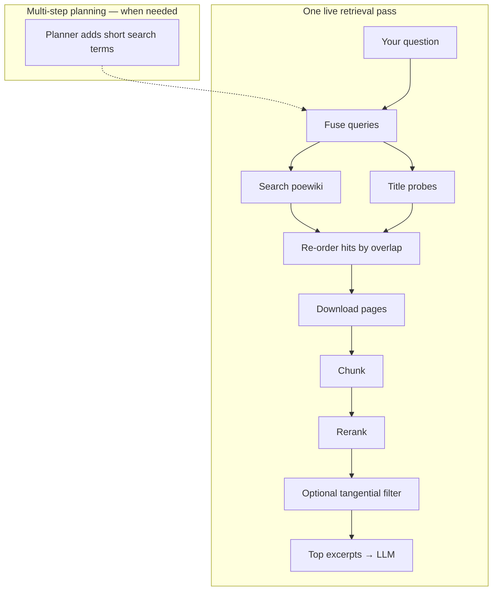

# Siosa's Library

**Path of Exile 1** wiki Q&A — live [poewiki.net](https://www.poewiki.net) retrieval, cited answers, optional multi-step planning.

**Demo** [poesiosa.net](https://www.poesiosa.net/) · **Docs** [Architecture](docs/architecture.html) · [Changelog](docs/changelog.html) · [Deploy](DEPLOY.md)

## How it works

**Interactive pipeline** (hover steps, alternatives): [Architecture](docs/architecture.html#pipeline-overview).

**Developer setup** → [CONTRIBUTING.md](CONTRIBUTING.md) and [docs/LAPTOP_SETUP.md](docs/LAPTOP_SETUP.md).

## License

Source code: [MIT](LICENSE). Game artwork in `web/public/art assets/` is **not** MIT-licensed — see [NOTICE](NOTICE). Not affiliated with Grinding Gear Games.
